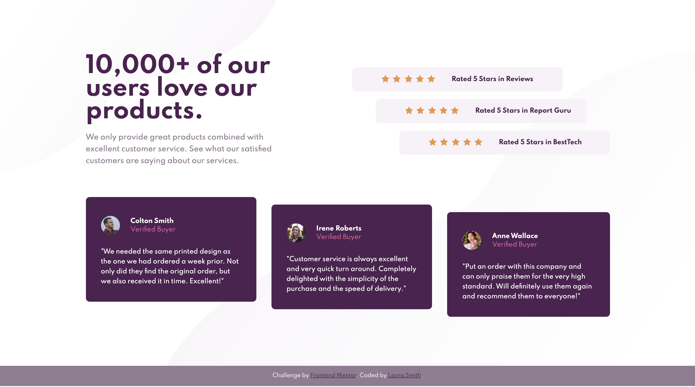

# Frontend Mentor - Social proof section solution

This is a solution to the [Social proof section challenge on Frontend Mentor](https://www.frontendmentor.io/challenges/social-proof-section-6e0qTv_bA). Frontend Mentor challenges help you improve your coding skills by building realistic projects. 

## Table of contents

- [Overview](#overview)
  - [The challenge](#the-challenge)
  - [Screenshot](#screenshot)
  - [Links](#links)
- [My process](#my-process)
  - [Built with](#built-with)
  - [What I learned](#what-i-learned)
  - [Continued development](#continued-development)
  - [Useful resources](#useful-resources)
- [Author](#author)
- [Acknowledgments](#acknowledgments)

## Overview

### The challenge

Users should be able to:

- View the optimal layout for the section depending on their device's screen size

### Screenshot



### Links
- [Live Site URL](https://laurana88.github.io/social-proof/)

## My process

### Built with

- Semantic HTML5 markup
- Sass
- Flexbox
- Mobile-first workflow

### What I learned

I did this Frontend Mentor challenge as part of the Zero to Mastery workshop. It was perfect to see the whole workflow from start to finish as I had always "jumped in" halfway into projects or designs.

I learned the following workflow set up repo/git -> plan out my structure -> HTML markup -> reset css -> reusable & base styles -> style pave top down (mobile first) -> expand out to wider screens and add media queries (tablet/desktop).

I also used the project to learn [Sass](https://sass-lang.com/) & [Google's new variable fonts](https://codepen.io/davelab6/pen/QWEJpWa).

For Sass I focused on setting up variables, watching the scss file, and nesting.
```css
/* Color variables */
$magenta: hsl(300, 43%, 22%);
$pink: hsl(333, 80%, 67%);
$darkMagenta: hsl(303, 10%, 53%);
$lightMagenta: hsl(300, 24%, 96%);
$white: hsl(0, 0%, 100%);
```
```
sass --watch global.scss global.css
```
```css
.ratings {
    margin: $xlSpace 0 $xxlSpace;

    > * + * {
        margin-top: $smSpace;
    }
}
```

For the variable fonts, I learned how to add the new API:
```html
<!-- Fonts -->
    <link rel="stylesheet" href="https://fonts.googleapis.com/css2?family=Spartan:wght@400..700&display=swap">
```

### Continued development

I'd like to work more with Sass and understand how I can incorporate it into additional projects. It has a lot more capabilities that I'd like to be able to implement. 

I also saw how you can make [bouncing text](https://codepen.io/davelab6/pen/QWEJpWa) with font variables and I'd like to experiment with this to become comfortable with the new font capabilities

### Useful resources

- [The Stack Library](https://every-layout.dev/layouts/stack/) - This taught me about the owl syntax.
- [CSS Tricks - Flex Box](https://css-tricks.com/snippets/css/a-guide-to-flexbox/) - Good source to grab the properties I need (struggle to remember off the top of my head).

## Author

- Website - [Laura Smith](https://www.lauraannsmith.com)
- Frontend Mentor - [@laurana88](https://www.frontendmentor.io/profile/laurana88)
- Twitter - [@musingsofarover](https://www.twitter.com/musingsofarover)
